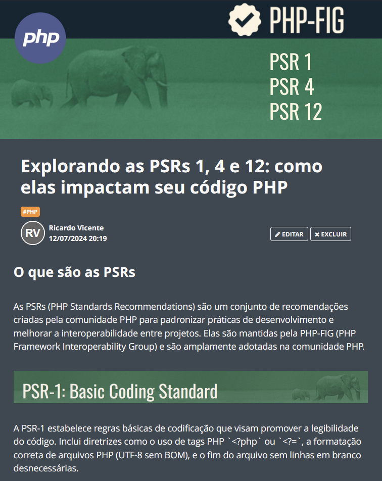

    

  
  

-------

  

# Projeto artigo técnico gerado por IAs

 > ℹ️ **NOTE:** Este é o repositório desenvolvido durante o curso no qual fui aluno da [DIO](https://dio.me).

Projeto com o objetivo de gerar um artigo técnico com um layout rico, leitura agradável e com foco em promover sua autoridade técnica.

<a href="https://web.dio.me/articles/explorando-as-psrs-1-4-e-12-como-elas-impactam-seu-codigo-php" title="View PDF now"> 📕Clique aqui para ler o artigo</a>

## 💻 Tecnologias utilizadas no projeto

- [ChatGPT](https://chat.openai.com/) - para título e conteúdo
- [Photopea](https://photopea.com/) - para criar imagens

## 📄 Prompts e ferramentas

ChatGPT：

|   Ação   | prompt                                                                                                                                                                                                                                                                         |
| :------: | ------------------------------------------------------------------------------------------------------------------------------------------------------------------------------------------------------------------------------------------------------------------------------ |
|  título  | Crie 10 headlines para nomes de artigos sobre o assunto "PHP - PSRs"                                                                                                                                                                                                    |
| conteúdo | Comporte-se com um escritor de artigos técnicos da linguagem php e crie um artigo com as regras abaixo {REGRAS} > no máximo 5 linhas por blocos de explicação > me explique de maneira que atenda um desenvolvedor de nível junior > crie subtítulos e separe por blocos cada parte do artigo > os blocos que serão criados estão abaixo: - O que são as PSRs - Sobre a PSR 1 - Sobre a PSR 4 - Sobre a PSR 12 - Faça um call to action para redes sociais - Coloque 3 hashtags que façam sentido. Ilustrações geradas por: humano via Photopea. Conteúdo gerado por: ChatGPT e revisões humanas |
| conteúdo | Faça um resumo com todas as regras da página https://www.php-fig.org/psr/psr-1/ |
| conteúdo | Faça um resumo com todas as regras da página https://www.php-fig.org/psr/psr-4/ |
| conteúdo | Faça um resumo com todas as regras da página https://www.php-fig.org/psr/psr-12/ |
| conteúdo | Gere um código php exemplo com essas regras |
| conteúdo | Crie uma conclusão com essas 3 psr, 1, 4 e 12. |

## ✨ Features

- Conteúdo gerado via ChatGPT
